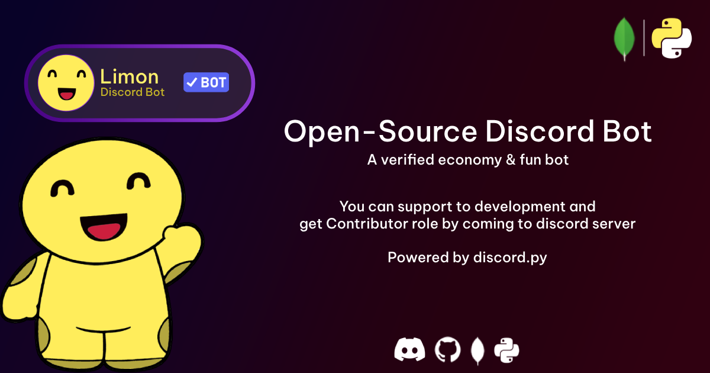

# 🍋 [Limon - Discord Bot](https://discord.com/api/oauth2/authorize?client_id=994143430504620072&permissions=139586817088&scope=applications.commands%20bot)
*A Verified Economy & Fun bot for Discord
[Join to Support Server](https://discord.gg/8YX57rBGTM)*

## License
Limon Bot is licensed under the terms of [Creative Commons Attribution-NonCommercial-ShareAlike 4.0 International](https://github.com/AbdurrahmanCosar/Limon/blob/main/LICENSE) ("CC-BY-NC-SA-4.0"). Commercial use is not allowed under this license. This includes any kind of revenue made with or based upon the software, even donations.

The CC-BY-NC-SA-4.0 allows you to:

Under the following terms:

- **Attribution** — You must give appropriate credit, provide a link to the license, and indicate if changes were made. You may do so in any reasonable manner, but not in any way that suggests the licensor endorses you or your use.
- **NonCommercial** — You may not use the material for commercial purposes.
- **ShareAlike** — If you remix, transform, or build upon the material, you must distribute your contributions under the same license as the original.

More information can be found [here](https://creativecommons.org/licenses/by-nc-sa/4.0/).

## Contributing

All merge requests are welcome! Just make sure to sign the [CLA](https://cla-assistant.io/AbdurrahmanCosar/Limon) or else we cannot merge your changes.
